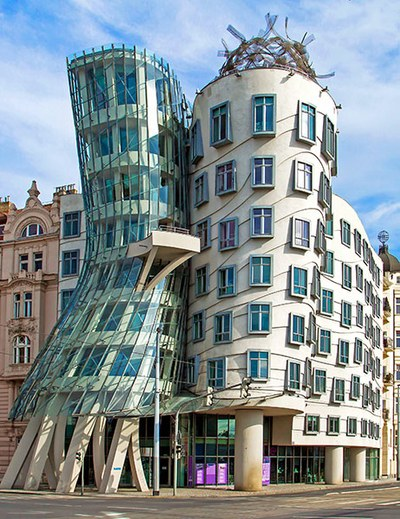
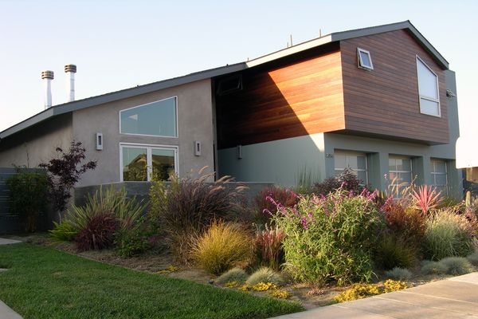
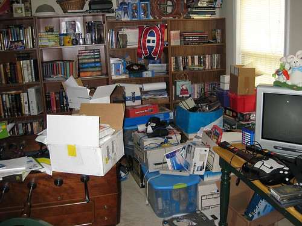
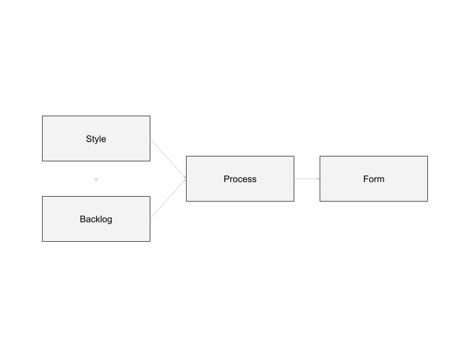
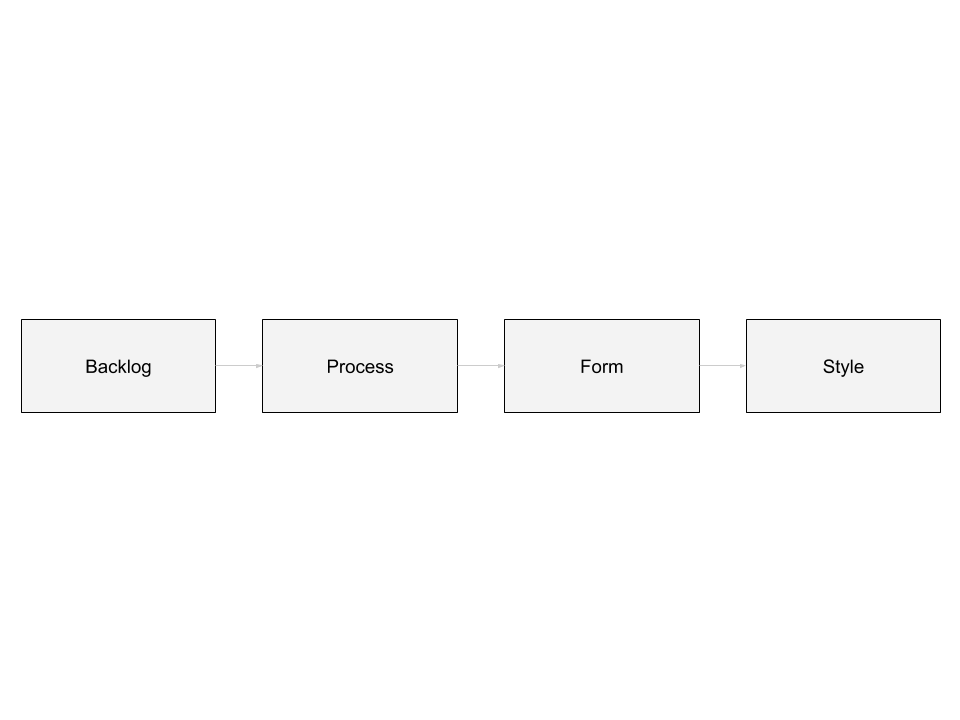

Software design was the thing that had
rescued me from the benighted maze of procedures and for
loops that passed for code in high school and college. I
worshipped gurus like Gary Bernhardt and Sandi Metz. I
wanted to write code like them.

class: center, middle

maintainable code &rarr; small classes

&there4; !(small classes) &rarr; !(maintainable code)

???

What *does* follow is that if you don't have the stylistic
features of the experts your code is very likely to *not*
be maintainable.

So there's a certain Pascal's Wager type logic to this,
where we're like "well, we know that if we *don't* have
small methods and high test coverage, we *definitely* won't
have maintainable code."

---

class: center, middle, dark

???

This would be harmless if applying style to our programs
didn't have a cost. But it does.

The problem is, this is a bit like saying "You can't win the
lottery if you don't buy a ticket." It's logically true, but
that doesn't mean lottery tickets are a good investment.

---

## accidental complexity != essential complexity

???

Stylistic elements imposed on our programs often create
accidental complexity. This is a term from Fred Brooks, from
his essay "No Silver Bullet".

Accidental complexity is
complexity in a program that isn't due to inherent
complexity in the problem it's trying to solve, but from
some other, imposed constraint on the programming process.

So, to summarize:

Imposing style on our programs *does* produce the surface
characteristics that are necessary for maintainable code.
But it also produces accidental complexity, and doesn't
necessarily result in actual maintainability.

---

## accidental complexity

class: center, middle

## style

---

class: center, middle

## style

## =

## arbitrary restrictions on form

---

class: center, middle

## simplicity

## =

## –arbitrariness

???

simplicity is the opposite of arbitrariness. A simple design
is one in which no arbitrary distinctions or irregularities
are present.

> We were trying to find a path using her rules that would lead to my objects. Because if we could find that path, it meant we could teach OO without having our teaching technique be “can’t you just see?”.

<cite>Sandi Metz</cite>

---

class: center, middle, dark

## A Question of Style

???

And I think this is the fundamental issue. These differences
of opinion, what amounts to differences of programming
style among developers on a team.

Why did the codebases get bad?

Style.

---

class: center, middle, dark

???

Sometimes it was an individual developer or a small cadre
of developers who piled elaborate stylistic elements onto
their code to show off their virtuosity.

---

class: center, middle, dark

???

Sometimes differences among the programmers drove each into
their own little silo. Their styles just sat next to
each other without forming a coherent whole.

---

class: center, middle, dark

???

Sometimes a particular style was taken as a proxy for value,
or adopted out of fear of doing the wrong thing, of seeming
"unprofessional".

---

class: center, middle, dark

.too-tall[
  
]

???

Sometimes, the developers dearly wanted a clean codebase;
organization worthy of a magazine cover.

---

class: center, middle, dark

???

But their efforts to tidy up just turned their mess into
a compartmentalized mess. Everything still disorganized, but
now hidden away in boxes where no one could find it.

---

class: middle, dark

### **style:** _(n)_

???

Up until this point I have not defined what I actually mean
by "style". There are actually two definitions

---

class: middle, dark

### **style:** _(n)_ the set of constraints imposed on the design of an artifact that are unrelated to the problems or forces the artifact is supposed to resolve.

### **style:** _(n)_ a constrained solution space, adopted to make adequate solutions easier to find.

### **style:** _(n)_ the formal attributes of a solution devised by a master.

???

Style is...

There's style as applied to the work of non-experts. That's
a constraint we take on to shrink the solution space we
have to search when designing. We have to constrain
ourselves this way because we're not experts. We can't just
intuitively see the right solution. We have to search for
it.

Then there's the expert's, the master's style. This isn't
a constraint assumed by the master when they're working. It
emerges from the form of the resulting solution. It's
something we observe after the fact.

To disambiguate these, I'll call them student-style and
master-style.

---

"-ilities" &rarr; formal properties

!(formal properties) &rarr; !"-ilities"

~~formal properties &rarr; "-ilities"~~

Any first-year logic student knows this isn't a valid
conclusion. Yet we act as if it's true.

---

"beginners need rules"

"we observe that the code of masters, which has desirable properties beyond its function, has certain formal properties"

"since the desirable -ilities correlate with these formal properties in experts' code, maybe the formal properties cause the -ilities"

"beginners should be guided by rules derived from the forms in experts' code"

¯\\\_(ツ)\_/¯ Q.E.D.

---

???

That might make you think style is unnecessary. And, in
theory, perhaps it is. But in practice, it's inescapable.

---

Style is a set of constraints. The constraints, in this
case, are rules that define the software development
process.

Experts don't need rules. They don't think in rules. Their
style is not a conscious act, not a constraint, but the
result of intuition. But beginners need rules.

---

In other fields, like painting and music and architecture,
beginners start by imitating the styles of masters. They do
that until they have enough experience and intuition that
they can start developing a style of their own.

---

The problem is, programming isn't painting. Painters copy
the masters for practice. We're not practicing. We're
performing. We're improvising. And, as we've seen, following
the rules of another's style simply isn't enough to get a
good result when you're improvising a program with a team.

---

class: dark

???

In effect, style is one of the inputs (along with our
backlog of features) that we consider in our programming
process. The process, given style and a set of requirements,
produces a program form.

We have a style in mind, and we involve the development
process to project that style onto the requirements, the
desired behavior of the program.

This concept of style implies that style is in a sense
"pasted on" or arbitrary. It could be swapped out for any
other style. Mathematically, we know this to be true because
all the programming paradigms we work with are
Turing-complete. You can represent any program in any style
(which is not to say that you should. I'll come back to
that.)

---

- procedural
  - coroutine-based
- object-oriented
  - MVC
  - Detroit TDD
  - London TDD
  - Dependency Injection
  - Command-Query Responsibility Separation (CQRS)
  - Domain-Driven Design
  - attribute-oriented
  - actors
- functional
  - IO monads
  - functional reactive programming
  - continuation-passing style
  - lazy evaluation

???

The problem with this approach is that it makes "good style"
a subjective matter. Some people prefer an object-oriented
style, some functional, some procedural. People will have
debates about why one style is better than another, but
these debates produce no clear winner. Ultimately, the
choice of style appears to be a matter of opinion.

But it goes beyond that. People's identities, and even the
identities of whole communities, get caught up in questions
of style. A threat to one's favored style is a threat to
one's self-image and prestige, and by proxy a threat to
one's professional community. Debates about style often get
heated.

One way of resolving this is to say "well, different styles
are suited to different problems, and you have to make
choices in context." But that feels more like a shrug than
an answer. It doesn't actually help us with the question of
how to write maintainable programs. We could also try to
create a "style map" that tells us what style to use to
solve particular programming problems. In effect, that's
what frameworks like Ruby on Rails and Spring try to do: say,
"for this constrained problem space, you can just apply this
box of tools and get a good result." I'm skeptical. The
problems we need to solve are always changing; it's hard
for a framework to evolve fast enough to keep up. And if
you make a framework general enough to adapt to any problem,
what you have is a programming language, and we're back to
square one, left with the question: how should we program?

Programming is complicated. We often choose the
wrong approach, even in the context of a particular program;
I doubt we can do better by trying to generalize across all
possible programs. In the future, there may be types of
programs and new programming styles and paradigms that would
invalidate such a "style map". In addition, I think that
many programs are best served by a fusion of different
styles, and the ways that these interact can be very complex
and dependent on context. Finally, people often
misunderstand what a style is all about. I've read and
worked on a good deal of "object-oriented" code that was
almost all static methods, seemingly arbitrarily split up
into stateless classes. So merely stating that "X style is
good for Y problem" is not going to solve the problem of
people cargo-culting their image of a style, of imposing an
image from outside. Even if you choose the right paradigm,
if you start by forcing the style onto the program instead
of letting it emerge naturally, you won't get a good result.

---

class: dark

???

All this presupposes that style is something you put into the
process to produce an ultimate form. But I actually don't
think that's necessarily true. We might imagine a process
that takes only a backlog of features as inputs and produces
a style as a result of the form that implements those
features.

This might sound like a strange thought to have. The only
reason I'm having it at all is because I read a book about
archtecture.

Instead, I contend that we need to think of style
differently. Style is something that you infer by looking at
the form of a program, but it doesn't determine the form.
It is descriptive, not prescriptive.

The obvious problem with this workflow is that, without
style as an input, we have no idea how to program. I mean,
think about it: if I told you to write a program, but don't
make it object-oriented or functional or procedural or
actor-based or reactive or MVC... what the heck would you
do? Style is the air we breathe; it seems to shape our every
thought about programming. How can we possibly get away from
it?

Fortunately, other people have made inroads on exactly this
problem. One of those people is Christopher Alexander, so
I'm now going to take a detour to explore what he has to say
on the matter.

---

???

Christopher Alexander is a fascinating figure. He's an
architect (of buildings) and he has written extensively
about his philosophy of architecture, but he is unique in
that he's been engaged in dialogue with software engineering
communities for decades. His breakout work, A Pattern
Language, inspired the Gang of Four patterns book. The
companion volume to A Pattern Language, is this book, The
Timeless Way of Building, which is more abstract and
philosophical. Kent Beck references this book in Extreme
Programming Explained, 2nd Ed. Alexander wrote the foreword
to Richard Gabriel's book, Patterns of Software: Tales from
the Software Community, which was itself inspired by
Alexander's work. In Alexander's magnum opus, The Nature of
Order, he cites XP and describes how his ideas are currently
being applied to software.

I'm looping the works of Christopher Alexander into this
talk because he's written a lot about style and the role of
the architect in the building process.

---
